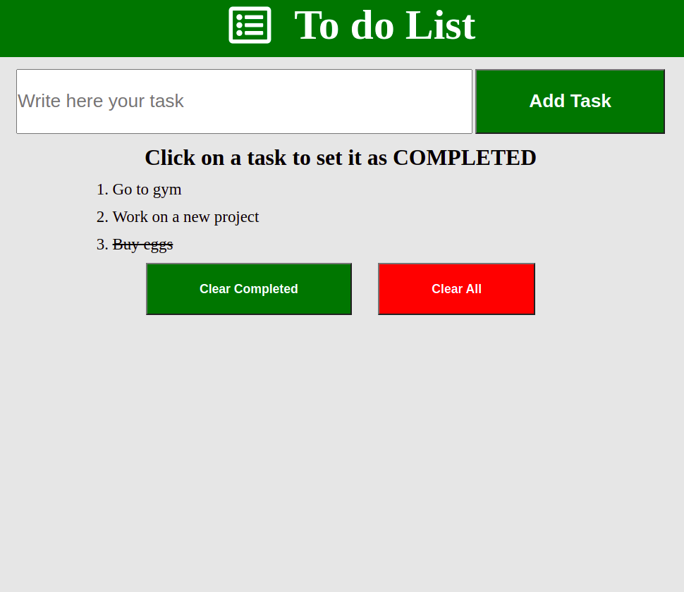

# Boas vindas ao repositório do projeto Lista de Tarefas!

Olá seja bem vindo(a) ao meu primeiro todo-list, esse projeto foi desenvolvido durante o curso da Trybe no módulo de Front-end.

---

# Sumário

- [Habilidades treinadas](#habilidades-treinadas)
- [A aplicação](#a-aplicação)
- [Instruções para acessar o projeto](#instruções-para-acessar-o-projeto)
- [Acessar aplicação](#acessar-aplicação)

# Habilidades treinadas

- Manipular CSS

- Manipular Javascript

--- 
# A aplicação

---

## Instruções para acessar o projeto:

1. Clone o repositório
  * `git clone git@github.com:LeoFuna/Project-todo-list.git`.
  * Entre na pasta do repositório que você acabou de clonar:
    * `cd Project-todo-list`

2. Inicialize o projeto

---

# Acessar aplicação
- [Ver em funcionamento](https://leofuna.github.io/Project-todo-list/)
